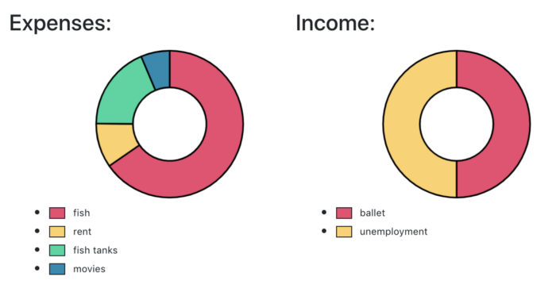
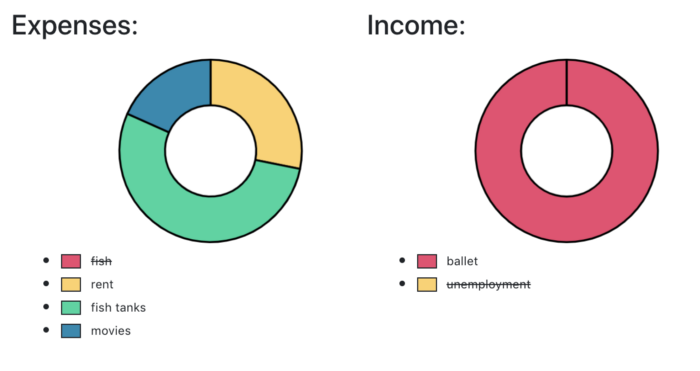

There’s not much information on how to use the Chart.js's **legendCallback** option to generate a custom legend, especially with React functional components/hooks. I had a lot of trouble figuring out how to do this and wanted to share what I learned.

I needed to create a custom legend to address discrepancies in size between two side-by-side Doughnut charts with different amounts of data. The charts kept rendering with different sizes, and after some Google-ing I decided the best way to solve this would be to generate my own legends.

To make your own custom legend, you need to make sure that you don’t display the default legend, and then provide your chart with a callback function in its **options** object:

```javascript
const options = {
  legend: {
    display: false
  },
  legendCallback: () => {
    // your legend callback function here
  }
}
```

In my case, I wanted to create a simple legend that shows each of my labels next to the color block that represents it in the chart, so this is what the callback looks like:

```javascript
legendCallback: (chartInstance) => {
  let labels = chartInstance.data.labels
  let clrs = chartInstance.data.datasets[0].backgroundColor
  let borderWidth = chartInstance.data.datasets[0].borderWidth

  return (
    <ul className="chart-legend">
      {labels && labels.map((label, index) => (
        <li onClick={(event) => handleLegendClick(event, index, chartInstance)}>
          <div className="legend-block" style={{backgroundColor: colors[index], border: `${borderWidth}px solid`}} />
          {labels && <div className="legend-label">{labels[index]}</div>}
        </li>
      ))}
    </ul>
  )
}
```

I’m just using some classic JSX to iterate over my chart’s labels and create a `<li>` for each label with a color block and its corresponding text. I’m also giving each item an interactive click handler. So far so good!

The tricky part for me was the next step. Chart.js doesn’t automatically render this legend for you — you need to call `generateLegend()` on your chart instance in order for the legend to actually render in the DOM. So I needed to access the chart’s DOM node in order to call `generateLegend()`. My immediate thought (and probably yours too) was, “This sounds like a great use case for React’s **useRef** hook!”, and I was right, sort of.

Unfortunately, I found that the chart legend still wasn’t rendering 100% of the time. Eventually I realized that I had created a race condition where if the chart’s DOM node didn’t exist yet, the legend wouldn’t render. “Fine,” I thought, “I’ll just use React’s **useEffect hook**, use the chart’s ref as a dependency, and update the legend whenever the ref changes.” But I was foiled again. I soon found out that you can’t use a ref as a dependency for **useEffect**. Here’s an explanation of why not to use a ref as a dependency in a useEffect call, from the [React docs](https://reactjs.org/docs/hooks-faq.html#how-can-i-measure-a-dom-node): “…an object ref doesn’t notify us about changes to the current ref value.” So it follows that **useEffect** will never get called if we never get notified about changes to the ref value.

Instead, React recommends that you use a different hook — **useCallback** — to notify us whenever the ref changes. Now we can call `generateLegend()` inside of this callback. Then, instead of giving your chart instance’s 'ref' attribute a standard ref object created from **useRef**, we give it that callback we just defined. When the DOM node changes, it will call **useCallback**, our legend will be generated, and all will be well! Here’s what it looks like, and note that I’m using the **useState** hook as well in order to store state for the DOM node and our legend:

```javascript
const [legend, setLegend] = useState()
const [ref, setRef] = useState()

const onRefChange = useCallback(node => {

  // ref value changed to node
  setRef(node) // e.g. change ref state to trigger re-render
  if (node !== null) {
    setLegend(node.chartInstance.generateLegend())
  }
}, [])

```

And here is what rendering the `Doughnut` component inside a parent component will now look like, using that callback for its 'ref' attribute:

```javascript
export const Parent = () => {

  // ...your parent component's contents
  
  return (
    <Doughnut date={chart} options={options} ref={onRefChange}>
  )
}
```
One last thing: I wanted my legend to be interactive, similar to Chart.js’s default legend. As I mentioned above, I passed a click handler to each `<li>` in my legend callback. The default Chart.js legend responds to clicks by crossing out the legend item and removing it from the chart, creating an interactive chart where the user can choose which data is being visualized. To replicate this behavior, I wrote the following click handler:

```javascript
const handleLegendClick = (event, datasetIndex, chartInstance) => {

  let e = event.target
  chartInstance.getDatasetMeta(0).data[datasetIndex].hidden = 
  chartInstance.getDatasetMeta(0).data[datasetIndex].hidden ? false : true
  e.classList.toggle("crossed-line")

  chartInstance.update()
}
```

I simply access the relevant index in the chart instance’s data and toggle it’s ‘hidden’ attribute and then toggle the element’s class name (I use CSS to cross out elements in the “crossed-line” class). Easy as pie (or…doughnuts, in this case? Sorry, I couldn’t help it). Here’s what it looks like!



And with some items crossed out:




I hope you enjoyed learning about custom legends in Chart.js! If you want to check out the repo for the project in which I implemented these charts, it’s available [here](https://github.com/hankthemason/finances-tracker).