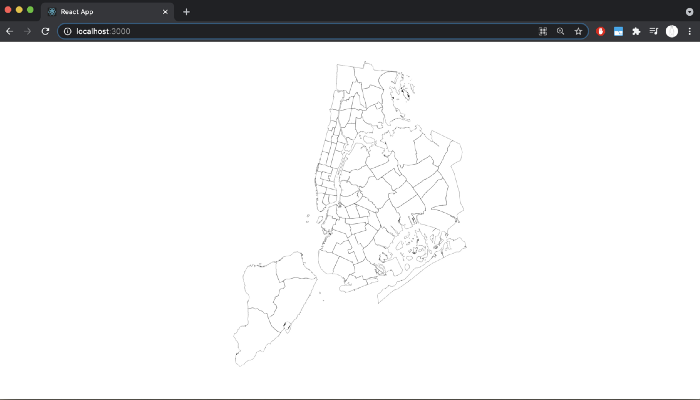

We are going to use React and D3 to build a map of police precincts in NYC. Then we’ll use publicly available records on NYPD misconduct to turn it into a colorized heat map. Let’s get started!

**Step 1: Create a new react app and install D3**

Open a new terminal and navigate to where you want to keep your project. Type the following commands into your terminal:

<div style="width: 50%">

```console
$ create-react-app nypd-precinct-map
$ cd nypd-precinct-map
$ yarn add d3
```

</div>

**Step 2: Understanding maps in D3**


In order to render a map in D3, we are going to need 3 things:


-The geographic information used to render the lines of our map, typically in **GeoJSON** or **TopoJSON** format. We will be using a GeoJSON file for this project.

-A projection function which will translate points with latitude/longitude coordinates on a 3-dimensional sphere to points with x/y coordinates on a 2-dimensional plane. D3 provides a handful of projections; we will be using the **geoAlbers** projection.

-A geographic path generator that will transform our GeoJSON file into an SVG path data string. D3 provides us with a `geoPath()` function to do this. We can give it the projection we just made as a first argument.

**Step 3: Make the Map component**

Now we can start building the map! Create a new file, **Map.jsx** in your **/src** directory. We want to import D3 and import React’s **useRef** hook. Then we’ll create and export a functional component called `Map`, which as of now takes in a prop called **geoJSON**, and returns an `<svg>` element wrapped in a `<div>`. We also need to create a variable called `svgRef` using the **useRef** hook. This will store a reference to the `<svg>` element that contains our map, and it will allow us to call D3 methods on it. The component will look like this:

```javascript
import { useRef } from 'react'
import * as d3 from 'd3'

export const Map = (props) => {

  const { geoJson } = props

  const svgRef = useRef()

  return (
    <div className='wrapper'>
      <svg className='precincts-map' ref={svgRef} height={500} width={500} />
    </div>
  )
}
```

Now we are ready to start using D3! First, we need to import another hook from React: **useEffect**. **useEffect** is used for executing side effects inside a functional component. Manipulating the DOM, which we will be doing with D3, is one such example of a side effect. Inside the **useEffect hook**, we’ll run the afore-mentioned projection and path generator functions. Then we’ll call a helper function called `renderMap()` to work D3’s magic and build our map!

```javascript
import { useRef, useEffect } from 'react'
import * as d3 from 'd3'

export const Map = (props) => {

  const { geoJson } = props

  const svgRef = useRef()

  const renderMap = (mapData, path) => {
    d3.select(svgRef.current)
      .selectAll('path')
      .data(mapData.features)
      .enter()
      .append('path')
      .attr('id', d => `precinct-${d.properties['Precinct']}`)
      .attr('d', path)
      .attr('stroke', '#000000')
      .attr('stroke-width', '.2')
      .attr('fill', 'transparent')
  }
  
  useEffect(() => {

    const height = svgRef.current.clientHeight
    const width = svgRef.current.clientWidth

    const projection = d3.geoAlbers().fitSize([height, width], geoJson)

	  const pathGenerator = d3.geoPath().projection(projection) 
    if (geoJson) {
      renderMap(geoJson, pathGenerator)
    }
  }, [geoJson])

  return (
    <div className='wrapper'>
      <svg 
        className='precincts-map' 
        ref={svgRef} 
        height={500} 
        width={500}
        style={{marginTop: '2em'}}
      />
    </div>
  )
}
```

It might look like a lot is going on here, but don’t panic! First look at the **useEffect** hook. We get the height and width of the bounding SVG element, and use those values to scale our projection correctly with D3’s `fitSize()` function. Then we call D3’s `geoPath()` function to generate our path. If our GeoJSON data is present, we can go ahead and render the map. Our `renderMap()` function is classic D3 and might appear odd, but it is actually simple when you break it down.

First we call `.select()` to select our `svgRef`, and then we call `selectAll()` to select the path elements we are going to be rendering (technically, we haven’t rendered these elements yet, which might seem confusing, but this is part of D3’s magic). Each of these elements will correspond with a precinct, which are defined in our GeoJSON object as ‘features.’ Next comes D3’s signature data join, in which we specify the data we will be joining to the path elements. This is how we bind each path element to a precinct (or feature). After that, we use D3’s `.attr()` method to give each `<path>` element a **'d'** attribute that corresponds to the **path** string we generated previously with the `geoPath()` function. This is how we define each precinct’s shape. After that, we give the `<path>` elements some more (optional) attributes that define their fill and stroke color. And now the Map component is complete! We are one step away from rendering our map.

**Step 4: Update the App.js component**

The only thing we have left to do is to update the App.js file to import the `Map` component, fetch the GeoJSON data, and then render the `Map` component with the GeoJSON data as a prop. This is what it will look like:

```javascript

import { useState, useEffect } from 'react'
import './App.css';
import { Map } from './Map'

const url = 'https://opendata.arcgis.com/datasets/c35786feb0ac4d1b964f41f874f151c1_0.geojson'

function App() {

  const [data, setData] = useState()

  useEffect(() => {
    fetch(url)
    .then(res => res.json())
    .then(res => setData(res))
  })
  return (
    <div className="App">
      <Map geoJson={data}/>
    </div>
  );
}

export default App;
```

First, we need to import React’s **useState** and **useEffect** hooks. Then we’ll import our `Map` component. Then we create a variable `url` to store the address we’ll be fetching the GeoJSON data from. We are getting our data from **ArcGIS**, a platform for open data sharing, but you can find GeoJSON data in plenty of other places. We’ll store our data using React’s **useState** hook. If you’re not familiar with [React hooks](https://reactjs.org/docs/hooks-state.html), don’t worry, just know that **useState** allows us to set and update state in a functional component (such as this one). Next we use another hook, useEffect, to fetch the data, convert it to a JSON object, and set it to our instance of state (using the setData function that useState returned when we initially invoked it). Remember, useEffect is used for executing side effects in a functional component, and fetching data is another instance of a side effect. Lastly, we add the Map component into our return statement, passing it the data variable as its geoJson prop. Now our map should be working! In your terminal, type: `$ yarn start` to run the React app, and then navigate to http://localhost:3000 in your browser to see it in action. It should look like this:



Congratulations! You’ve successfully rendered a map of NYC’s police precincts! Next we are going to use public records to turn our map into a heat map showing how many allegations of misconduct are connected to each precinct.

Here is Part 2 of this tutorial: https://hankthemason.medium.com/build-a-map-of-nycs-police-precincts-with-react-d3-part-2-f02620395bf5

Here is the GitHub repo for this project: https://github.com/hankthemason/nyc-precinct-map-tutorial-pt1

