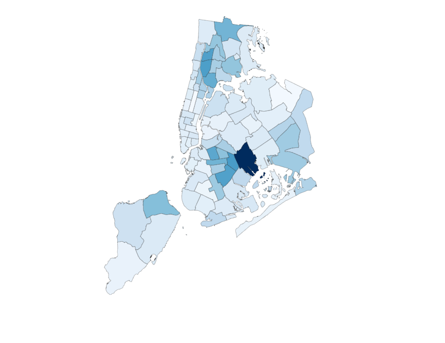

In Part 2 of this tutorial, we are going to turn our basic map into a heat map that visualizes the amount of total allegations filed against each precinct. If you missed [Part 1](http://hankthemason.github.io/blog/d3_maps_pt1), I recommend reading that first.

Now that we have a basic working map, let’s use it to show some data! The data we are going to be using comes from [ProPublica’s](https://projects.propublica.org/nypd-ccrb/) release of over 33,300 records of misconduct against the NYPD, dating back to 1985. The actual data parsing is outside the scope of this article — instead, we’ll be using a .json file that I made from the data and can be downloaded in this project’s [GitHub repo](https://github.com/hankthemason/nyc-precinct-map-tutorial-pt2/tree/main/src/data).

First let’s work on adding to our `App` component, since that is where we pass down props to our `Map` component, and we’ll need to pass it some new data. We can import the .json file at the top of our file with the following line of code:

```javascript
import { default as allegationsPerPrecinct } from './data/allegationsByPrecinct.json'
```

Then we’ll update how we render `Map` component, by passing it the `allegationsPerPrecinct` object we just imported as a new prop.<br>
<br>
  

```javascript
<Map geoJson={data} allegationsPerPrecinct={allegationsPerPrecinct}/>
``` 
<br>
Here’s what the finished App component looks like:<br>
<br>

```javascript
import { useState, useEffect } from 'react'
import './App.css';
import { Map } from './Map'
import { default as allegationsPerPrecinct } from './data/allegationsByPrecinct.json'

const url = 'https://opendata.arcgis.com/datasets/c35786feb0ac4d1b964f41f874f151c1_0.geojson'

function App() {

  const [data, setData] = useState()

  useEffect(() => {
    fetch(url)
    .then(res => res.json())
    .then(res => setData(res))
  }, [])
  
  return (
    <div className="App">
      <Map geoJson={data} allegationsPerPrecinct={allegationsPerPrecinct}/>
    </div>
  );
}

export default App;
```

Now we need to update our `Map` component in order to read the data and reflect it in our map. In our new heat map, we will be representing the amount of allegations associated with each precinct through a spectrum of colors. The more allegations a precinct has, the darker it will appear on the map. To do this, we need a **scale** function: a function that takes in a value in our input **domain** and returns a ‘scaled’ value within our output **range**. Once again, D3 provides a number of functions we can use, all of which have specific use cases. We will be using `scaleSequential()`, which is a good choice for generating color scales. We will be giving it two arguments: the input **domain**, and an interpolator that it will use to generate output in the form of an RGB value.

Let’s cover the input first. For our purposes, the **domain** will be all the possible numbers of allegations that a precinct can have, so it will include all numbers from 0 to the maximum amount of allegations that any precinct has. In order to get this value, we’ll use the `map()` iterator and ES6’s spread operator :

```javascript
const maxAllegations = Math.max(...allegations.map(obj => obj.allegations))
```

Now we can write our scale function. For its second argument, we’ll be using one of D3’s built-in interpolators, `interpolateBlues`, to generate RGB values in a spectrum of blue colors. The completed function will look like this:

```javascript
const scale = d3.scaleSequential([0, maxAllegations], d3.interpolateBlues)
```

The next part is a lot of fun, and is a great example of D3’s data-driven philosophy at work. In the earlier iteration of `Map`, our `renderMap()` function gave each path element a ‘fill’ attribute with the value of ‘transparent’. Obviously we need to change that if we want color, and D3 gives us a powerful way to do that dynamically. This time, each element's **‘fill’** attribute will be given a function instead of a string value, and inside that function we will generate a color for each `<path>` element. Remember, each of these elements corresponds to a precinct, so we can use the number of allegations associated with that precinct along with our previously-defined scale function to get the correct value for ‘fill’. Here’s what that part of the code will look like:

```javascript
.attr('fill', function(d) {
        const precinct = allegationsPerPrecinct.filter((item) => {
          return item.precinct === d.properties['Precinct'])[0]
        })
        return scale(precinct.allegations)
      })
```

We are using D3 to iterate over the features of our GeoJSON object and "draw" the path string for each feature, which corresponds to a precinct. For the **'fill'** attribute, we’ll access the current feature’s **‘Precinct’** property in order to filter our `allegationsPerPrecinct` array and find the corresponding precinct. Then we just pass the precinct's **‘allegations’** property into `scale()`, and it will return an RGB value. Reload your browser and look at the results. You should be rendering a colorized heat map now! Here’s what the finished Map component will look like:

```javascript
import { useRef, useEffect } from 'react'
import * as d3 from 'd3'

export const Map = (props) => {

  const { geoJson, allegationsPerPrecinct } = props
  
  const maxAllegations = Math.max(...allegationsPerPrecinct.map(obj => obj.allegations))
  const scale = d3.scaleSequential([0, maxAllegations], d3.interpolateBlues)

  const svgRef = useRef()

  const renderMap = (mapData, path) => {
    d3.select(svgRef.current)
      .selectAll('path')
      .data(mapData.features)
      .enter()
      .append('path')
      .attr('id', d => `precinct-${d.properties['Precinct']}`)
      .attr('d', path)
      .attr('stroke', '#000000')
      .attr('stroke-width', '.2')
      .attr('fill', function(d) {
          const precinct = allegationsPerPrecinct.filter((item) => {
            return item.precinct === d.properties['Precinct'])[0]
          })
          return scale(precinct.allegations)
        }) 
  }
  
  useEffect(() => {

    const height = svgRef.current.clientHeight
    const width = svgRef.current.clientWidth

    const projection = d3.geoAlbers().fitSize([height, width], geoJson)

	  const pathGenerator = d3.geoPath().projection(projection) 
    if (geoJson) {
      renderMap(geoJson, pathGenerator)
    }
  }, [geoJson])

  return (
    <div className='wrapper'>
      <svg 
        className='precincts-map' 
        ref={svgRef} 
        height={500} 
        width={500}
        style={{marginTop: '2em'}}
      />
    </div>
  )
}
```

And here’s the colorized heat map!




Congratulations! You know have a working heat map of NYC's police precincts!
If you have any questions, feel free to contact me.  Thanks for reading, and happy coding.

You can look at the original code and download it here: https://github.com/hankthemason/nyc-precinct-map-tutorial-pt2